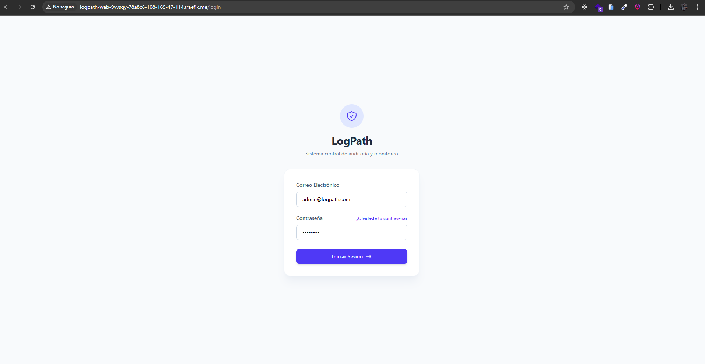
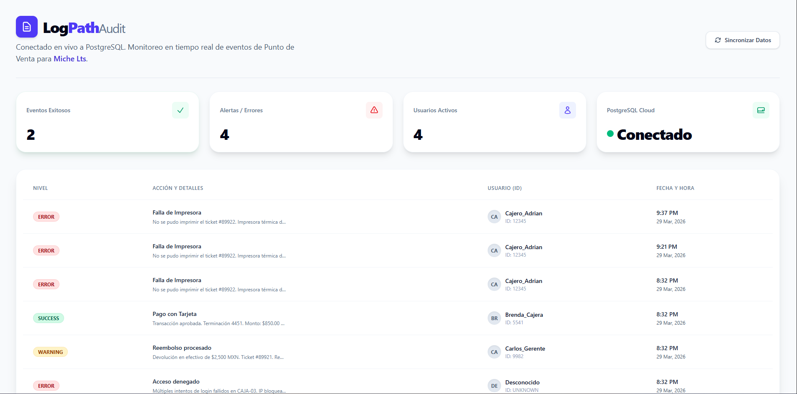
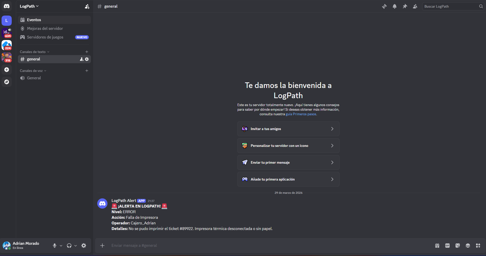

# 🛡️ LogPath: Telemetría y Auditoría Edge-to-Cloud para POS (Point Of Sale)

**LogPath** es una plataforma centralizada de monitoreo en tiempo real diseñada para auditar eventos críticos, transacciones y fallos de seguridad en sistemas de Punto de Venta (POS) distribuidos. 

Creado para la **Hackatón de CubePath 2026**.

http://logpath-web-9vvsqy-78a8c8-108-165-47-114.traefik.me/login

## 🚀 El Problema que Resuelve
Los negocios de retail generan miles de transacciones diarias. Detectar un fraude, un reembolso sospechoso o una falla de hardware a tiempo es casi imposible revisando bases de datos estáticas. **LogPath** transforma esos datos crudos en inteligencia de negocio y alertas en tiempo real.

## ✨ Características Principales (Innovación)

* **📊 Dashboard Inteligente:** Visualización de KPIs en tiempo real (Ventas, Alertas Críticas, Usuarios Activos).
* **🚨 Alertas Proactivas (Discord Webhooks):** Si un POS reporta un error crítico (Ej. Falla de impresora o acceso denegado), el backend intercepta la anomalía y dispara una alerta instantánea al equipo de TI en Discord.
* **📡 Telemetría Ligera:** Endpoint optimizado para recibir cargas de trabajo masivas desde cualquier cliente.
* **🐳 Infraestructura Cloud-Native:** Despliegue 100% contenerizado utilizando **Dokploy** como motor de orquestación en un VPS.

## 🏗️ Arquitectura Técnica

LogPath no es solo un CRUD, es un pipeline completo de telemetría:

1.  **Frontend (UI/UX):** Construido con `Angular` y `Tailwind CSS`. Diseñado para cero fricción cognitiva.
2.  **Backend (API Rest):** Desarrollado en `C#` y `.NET 10`. Maneja la ingesta de eventos de forma asíncrona.
3.  **Base de Datos:** `PostgreSQL` gestionado mediante Entity Framework Core (Code-First Migrations).
4.  **Despliegue (CubePath/Dokploy):** Integración continua (CI/CD) conectada a GitHub, sirviendo la aplicación a través de Traefik.

## ⚙️ Cómo probarlo

Puedes ver la aplicación funcionando en vivo aquí:
👉 **[LogPath Live Demo](http://logpath-web-9vvsqy-78a8c8-108-165-47-114.traefik.me/login)**
*(Nota: Haz clic en "Iniciar Sesión" para entrar directamente al Dashboard de prueba).*

## 👨‍💻 Autor
* **Adrián Morado** - Full-Stack & Cloud Developer.